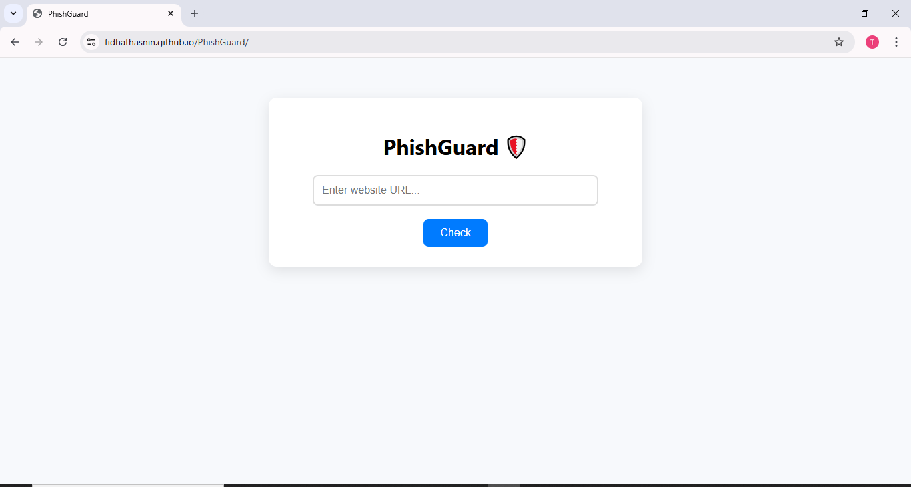

# 🛡️ PhishGuard - Phishing Website Detection Tool


PhishGuard is a web-based phishing detection system that helps users identify and avoid malicious websites. Built with React and hosted using GitHub Pages, PhishGuard checks URLs for suspicious patterns and informs users whether a website is safe or potentially a phishing attempt.


## 🚀 Live Demo

🔗 [Visit the PhishGuard Website](https://fidhathasnin.github.io/PhishGuard)

## 📌 Features

- 🔍 Real-time phishing URL detection  
- ⚠️ Visual alerts for suspicious websites  
- ✅ Clean UI built with React  
- 🌐 Hosted via GitHub Pages  

## 🧠 How It Works

PhishGuard analyzes the input URL using a set of detection rules that identify potential phishing attempts based on:
- URL patterns and structure
- Usage of suspicious keywords
- Length and special character density
- Future support for API-based or machine learning validation

> For now, detection is based on static logic and pre-defined heuristics.

## 📁 Project Structure

```
PhishGuard/
├── public/
├── src/
│   ├── components/
│   ├── App.js
│   ├── index.js
│   └── ...
├── package.json
└── README.md
```

## 🧰 Tech Stack

- **Frontend**: React.js  
- **Deployment**: GitHub Pages  
- **Optional Backend/API (Future)**: Firebase, VirusTotal API  

## 🛠️ Installation & Development

```bash
git clone https://github.com/fidhathasnin/PhishGuard.git
cd PhishGuard
npm install
npm start
```

### To Build for Production:

```bash
npm run build
```

### To Deploy:

Make sure your `package.json` includes the correct homepage:

```json
"homepage": "https://fidhathasnin.github.io/PhishGuard"
```

Then run:

```bash
npm run deploy
```

## 💡 Future Enhancements

- 🔐 Machine Learning model integration  
- 🌍 Browser extension support  
- 📡 Real-time blacklist lookup using VirusTotal API  
- 🛎️ User alerts and warnings before clicking suspicious links  
- 🔄 Firebase integration for dynamic scanning  

## 📸 Screenshots



## 👩‍💻 Developed By

**Fidha Thasni N**  
[LinkedIn](https://www.linkedin.com/in/fidha-thasni-n/) • [GitHub](https://github.com/fidhathasnin)

## 📜 License

This project is licensed under the [MIT License](LICENSE).

